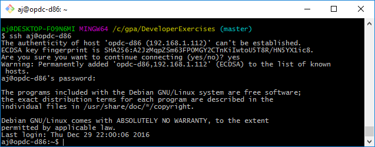

[](https://github.com/GridProtectionAlliance/openPDC "The Open Source Phasor Data Concentrator")

|   |   |   |
|---|---|---|
| **[Grid Protection Alliance](http://www.gridprotectionalliance.org "Grid Protection Alliance Home Page")** | **[openPDC Project](https://github.com/GridProtectionAlliance/openPDC "openPDC Project on GitHub")** | **[Exercises](README.md)** |

***This document is an exercise procedure for setting up and testing concepts.***

---

# openPDC in Debian Jessie

[Grid Protection Alliance **openPDC**](https://github.com/GridProtectionAlliance/openPDC)

This is a *cookbook recipe* style exercise procedure for setting up an openPDC Server virtual machine. This procedure was developed and tested using specified operating systems, software versions, and installation sequence. However, with appropriate modifications, this procedure should be adaptable to work in other hardware and software platforms.

- [Platform](#platform)
    - [Platform Description](#platform-description)
    - [Platform Configuration](#platform-configuration)
        - [`GPA-VBOX` Platform Host Server](#gpa-vbox-platform-host-server)
        - [`OPDC-D86` openPDC Server virtual machine](#opdc-d86-openpdc-server-virtual-machine)
    - [Host Server Setup](#host-server-setup)
        - [DNS Configuration](#dns-configuration)
        - [VirtualBox Virtual Machines Setup](#virtualbox-virtual-machines-setup)
            - [IMPORTANT: PASSWORDS](#important-passwords)
    - [`OPDC-D86` Server, Initial Setup](#opdc-d86-server-initial-setup)
- [`OPDC-D86` Server, GPA Software Installation](#opdc-d86-server-gpa-software-installation)

---

## Platform

### Platform Description

This example uses a Windows 10 *Host PC*, named [`GPA-VBOX`](#gpa-vbox-platform-host-server) running VirtualBox to host virtual machines configured with various operating systems and GPA software.

The virtual machines will be created with a clean operating system and software installed for this example. This document will try to highlight the non-default customized installation and configuration steps. This document does not include many *default* installation and configuration steps.

### Platform Configuration

#### **`GPA-VBOX`** Platform Host PC
    - Windows 10 Enterprise 2016 LTSB with Oracle VirtualBox 5.1.12 for hosting virtual machines
    - CPU = Intel i7, 2.8GHz, Laptop
    - RAM = 16GB, 2133 MHz, non-ECC
    - WiFi Ethernet with Internet access

#### **`OPDC-D86`** openPDC Server virtual machine
    - OS = Debian Jessie 8.6.0 amd64 from netinst.iso 
    - Software = **GPA Software**
    - CPU = 3 virtual cores
    - RAM = 3072 MB
	- Video Memory = 128 MB
    - VHD = 64 GB virtual hard drive
	- Network Adapter = Bridged Adapter
	- Do Not Set the *Hardware Clock in UTC Time* option
	
---

### Host PC Setup

In this example, the *Host PC* is a general purpose physical laptop whose function is providing a VirtualBox infrastructure to run the virtual machines. Setting up the *Host PC* is beyond the scope of this example. However, the only significant *Host PC* setup beyond a clean Windows install is the simple installation of [Oracle VirtualBox](http://www.virtualbox.org) software.

#### DNS Configuration

This exercise will use each machine's **hosts** file for DNS Host Name to IP Address resolution. The *Host PC* will keep its current *DHCP dynamic IP Address* and the virtual machines will use *static IPv4 addresses*.

This example's local area network (LAN) IP Address range is `192.168.1.0 to 192.168.1.255`. Your network will not likely use the same IP Addresses. Also the `gpa.net` domain name is arbitrary. If using a different domain name, make sure it does not conflict with a *real Internet domain* you may want to access. 

Do the following on the *Host PC*:

1. Open a *Command Prompt* as Administrator
2. Run `ipconfig /all`
	- Record the IPv4 Address.
	- Record the Default Gateway  
	- Record the DNS Server's IP Address
3. Run `ping 192.168.1.112` to test the IPv4 Address we will be assigning to the `OPDC-D86` virtual machine
    - Run `arp -a` to verify that 192.168.1.112 is not being used by any other MAC addresses.
    - If 192.168.1.112 is listed in the `arp -a` list, then pick a different IP address and test again
4. Run `notepac C:\Windows\system32\drivers\etc\hosts` and add the following entries
    - `192.168.1.40      gpa-vbox.gpa.net`
    - `192.168.1.40      GPA-VBOX`
    - `192.168.1.112     opdc-d86.gpa.net`
    - `192.168.1.112     OPDC-D86`
5. Run `ipconfig /flushdns` to clear the local DNS cache
6. Run `ping gpa-vbox.gpa.net` to make sure the new *hosts* file changes are in effect

#### VirtualBox Virtual Machines Setup

This example uses a minimal installation with [Debian 8.6.0 netinst.iso for amd64](http://mirrors.kernel.org/debian-cd/8.6.0/amd64/iso-cd/debian-8.6.0-amd64-netinst.iso) from [Mirrors.Kernel.org](http://mirrors.kernel.org).

##### **IMPORTANT: PASSWORDS**

In Production Deployments, complex passwords are desireable. However, in these cookbook scenarios, certain test procedures may be easier to troubleshoot if your passwords are at least 8 alpha-numeric characters long, with mixed character cases, and at least 1 numeric digit. For now, avoid short simple passwords and avoid using symbols in the passwords.  Especially avoid using symbols that are commonly used in shell scripting languages and database SQL queries.

---

## `OPDC-D86` Server Initial Setup

1. Download the `debian-8.6.0-amd64-netinst.iso` file to the [`GPA-VBOX`](#gpa-vbox-platform-host-server) server
2. On the [`GPA-VBOX`](#gpa-vbox-platform-host-server) server: create the [`OPDC-D86`](#opdc-d85-openpdc-server-virtual-machine) openPDC Server virtual machine.
    - Configure [`OPDC-D86`](#opdc-d86-openpdc-server-virtual-machine) VirtualBox *Settings* as described in the earlier [Platform Configuration](#platform-configuration) section and assign the `debian-8.6.0-amd64-netinst.iso` image file to its DVD drive.
3. Start the `OPDC-D86` virtual machine and run the Debian installation. 
	- In the *Configure the network / Please enter the hostname* dialog, set the *Hostname* to `opdc-d86` then press the *Enter* key to *Continue*
	- In the *Configure the network / Domain Name* dialog, set the *Domain name* to `gpa.net` then press the *Enter* key to *Continue*
	- When prompted to enter Passwords, follow the [Important: Passwords](#important-passwords) advice.
	- Continue with disk setup stuff and *Installing the base system*
	- Continue with selecting a download mirror and *Configuring apt*
	- In the *Software selection* dialog, Only select *SSH server* and un-select everything else
		- []()
	- Continue and complete the remaining installation
	- Reboot

### `OPDC-D86` Server Configuration

- 1. Login with the User account created during initial setup
- 2. Run `su` and enter the `root` account password
- 3. Run the following maintenance commands. Replace `<your_username>` with the User account created during initial setup.

```
apt-get update
apt-get dist-upgrade
apt-get install sudo
adduser <your_username> sudo
reboot
```

- 4. Login with the User account
	- Run `sudo ifconfig -a` and enter the root password to elevate privileges and execute the command
	- Make note of the Ethernet interface. It is probably `eth0`
- 5. Configure the static IP Address using *nano* or other Debian text editor

```sh
$ sudo nano /etc/network/interfaces
    ... 
    allow-hotplug eth0
    iface eth0 inet static
    address 192.168.1.112
    netmask 255.255.255.0
    gateway 192.168.1.1
    broadcast 192.168.1.255
    network 192.168.1.0
    dns-nameservers 192.168.1.249

$ sudo nano /etc/resolv.conf
	nameserver 192.168.1.249

$ reboot
```

- 6. *Ping* stuff to test the network and DNS configuration.

---

## `OPDC-D86` Server Software and Utilities Installation

Now that the base Debian operating system is installed and the machine has an IP address, it is probably easier to access the `OPDC-D86` machine using an **ssh** client that allows copy/paste clipboard. If you are running VirtualBox on a Windows *Host PC* as described for this exercise's `GPS-VBOX` laptop, then using Git's MINGW bash shell has a nice **ssh** console. In the Git console, simply run `ssh <your_username>@opdc-d86`

[]()

### Git

Building *Git* is not really required to install and run *openPDC*, however, downloading and building the latest version of *Git* is a good way to install some prerequisites we need later to build *openPDC*

```sh
# Install Git prerequisites
sudo apt-get install ca-certificates xz-utils -y
sudo apt-get install build-essential gettext libssl-dev libcurl4-openssl-dev libexpat1-dev tk-dev asciidoc docbook2x unzip -y
# Change to Home folder
cd ~
# Get git
wget https://www.kernel.org/pub/software/scm/git/git-2.11.0.tar.gz 
tar -xzvf git-2.11.0.tar.gz
cd git-2.11.0
# Make Git and Install 
make prefix=/usr/local all doc info
sudo make prefix=/usr/local install all install-doc install-html install-info
# Test Git
git –version
```

### Python

Python might be required for properly building or testing mono

```sh
# Python 2
cd ~/
wget https://www.python.org/ftp/python/2.7.12/Python-2.7.12.tar.xz
tar -xvf Python-2.7.12.tar.xz
cd Python-2.7.12
./configure
make
sudo make install
python2 --version
# Python 3
cd ~/
wget https://www.python.org/ftp/python/3.5.2/Python-3.5.2.tar.xz 
tar -xvf Python-3.5.2.tar.xz
cd Python-3.5.2
./configure
make
sudo make install
python3 --version
```

### Mono

Build Mono from a release tarball.   

```sh
# Install dependencies.  
sudo apt-get install build-essential gettext libtool automake cmake -y
sudo apt-get install mono-devel -y

# Download the source code tarball file and extract and build it
cd ~
wget http://download.mono-project.com/sources/mono/mono-4.8.0.382.tar.bz2
tar -xvjf mono-4.8.0.382.tar.bz2
cd mono-4.8.0
./configure --prefix=/usr/local
make
sudo make install
sudo reboot
mono --version
```
---

## openPDC Installation

- 1. Download the openPDC installation script and run it using *sudo bash*

```sh
cd ~/
mkdir GPA
cd GPA
wget http://www.gridprotectionalliance.org/Products/openPDC/Scripts/install-openPDC.sh
sudo bash install-openPDC.sh -p
```

- 2. Test openPDC by running its console and typing ***version*** in the running console. Type ***exit*** to quit the console.

```sh
sudo mono /opt/openPDC/openPDC.exe -RunAsConsole
. . .
    Calculated 122 routes for 7 destinations in less than 1 millisecond.
    [STAT] AdoMetadataProvider has started metadata refresh...
    [STAT] AdoMetadataProvider has finished metadata refresh.
    [STAT] Connection established.
version

openPDC Service Version:

      App Domain: openPDCShell.exe, running on .NET 4.0.30319.42000
    Machine Name: opdc-d86
      OS Version: Unix 3.16.0.4
    Product Name: Debian GNU/Linux 8 (jessie) using Mono
  Working Memory: 108.7258 MiB
  Execution Mode: 64-bit
      Processors: 3
       Code Base: opt/openPDC/openPDCShell.exe
      Build Date: 12/29/2016 5:54:28 PM
         Version: 2.2.70.0
exit
```

***Notice that the script defaulted to openPDC version 2.2.70.0***

- 3. Uninstall openPDC by running `sudo bash install-openPDC.sh -u`
- 4. Install openPDC from the Nightly Builds by running `sudo bash install-openPDC.sh -n -p`
- 5. Test openPDC by running its console and typing ***version*** in the running console. Type ***exit*** to quit the console.

```sh
sudo mono /opt/openPDC/openPDC.exe -RunAsConsole
. . .
version

openPDC Service Version:

      App Domain: openPDCShell.exe, running on .NET 4.0.30319.42000
    Machine Name: opdc-d86
      OS Version: Unix 3.16.0.4
    Product Name: Debian GNU/Linux 8 (jessie) using Mono
  Working Memory: 96.6451 MiB
  Execution Mode: 64-bit
      Processors: 3
       Code Base: opt/openPDC/openPDCShell.exe
      Build Date: 12/29/2016 5:57:59 PM
         Version: 2.4.64.0
 exit
```

---

### Download the PMU Connection Tester Software and Save it to the `GPA.shared` Folder

**Do the following tasks in the `PMU-TESTER` Workstation:**

1. Open the *Windows Accessories / Internet Explorer* web browser
2. Navigate to the PMU Connection Tester Release page: [https://github.com/GridProtectionAlliance/PMUConnectionTester/releases](https://github.com/GridProtectionAlliance/PMUConnectionTester/releases)
3. Scroll down to the *Downloads* section and click on the [PMUConnectionTesterSetup.zip](https://github.com/GridProtectionAlliance/PMUConnectionTester/releases/download/v4.5.6/PMUConnectionTesterSetup.zip) link to start the download.
    - When prompted, drop down the *Save* button menu and click *Save as*
    - In the *Save As* dialog, browse to the mapped network drive `G:\`, then click the *Save* button.

### Install the PMU Connection Tester Software on the `OPDC-01` Server

**Do the following tasks in the `OPDC-01` Server**

1. Open the *Windows System / File Explorer* and navigate to the `C:\GPA\GPA.shared` folder.
2. Extract the `PMUConnectionTesterSetup.zip` contents to a new `C:\GPA\GPA.shared\PMUConnectionTesterSetup` folder and open the folder.
3. Run the *PMUConnectionTesterSetup64.msi* setup wizard
4. In the *Select Installation Folder* screen, change the *Folder* value to `C:\GPA\PMU Connection Tester\`
    - []()
5. Continue with the remaining PMU Connection Tester Setup by accepting the default values until it has completed.
6. Run the PMU Connection Tester application with its first time defaults and click the *Connect* button.  
    - []()


---

Dec 28, 2016 - Created by [aj](https://github.com/ajstadlin)  
Dec 30, 2016 - Updated by [aj](https://github.com/ajstadlin)

---

Copyright 2017 [Grid Protection Alliance](http://www.gridprotectionalliance.org)
